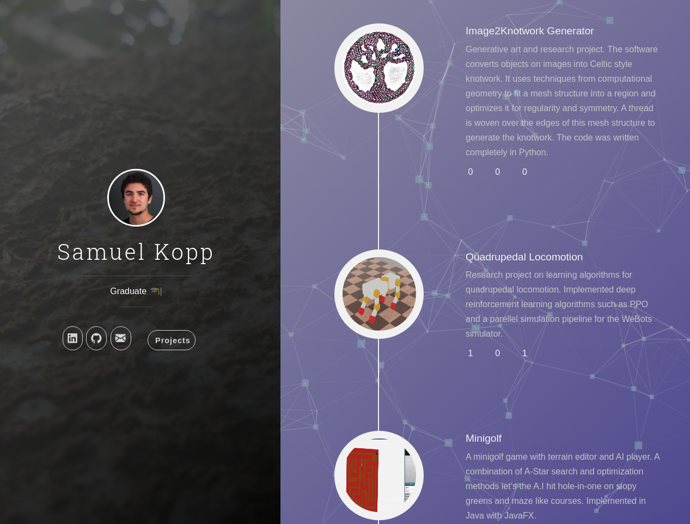

# Jekyll-Uno-Timeline with Particle.js and Typed.js
 [Uno-Timeline-Theme](https://github.com/tzuehlke/jekyll-uno-timeline) with moving particles and typed subtitle.

## How does is look
[Demo](samuel-kopp.com)

## Installation/Setup
1. Download or clone repo `https://github.com/Eslsamu/uno-timeline-extras.git'
2. Enter the folder: `cd uno-timeline-extras`
3. Build it: `jekyll build`
4. Start Jekyll server: `jekyll serve`
5. Configure: `_config.yml`
   * at least set `font_awesome` or download and add the font in `head.html`

Access via: [http://localhost:4000/](http://localhost:4000/)

 
